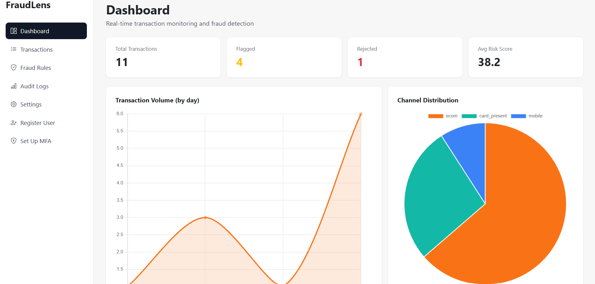
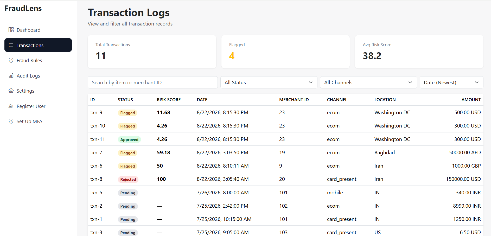
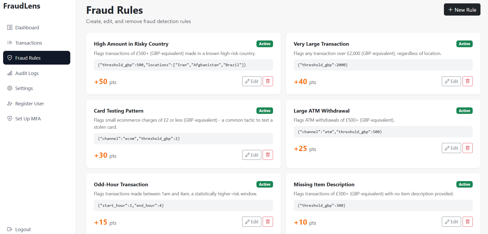
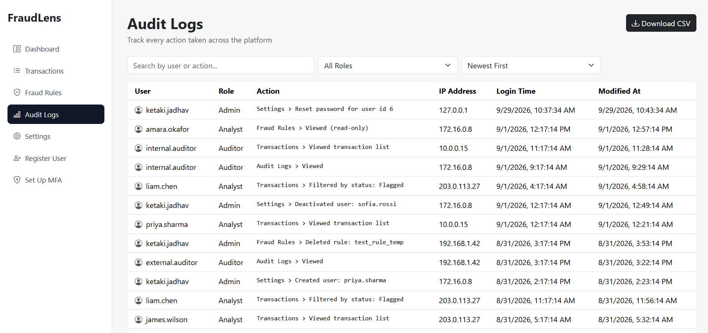
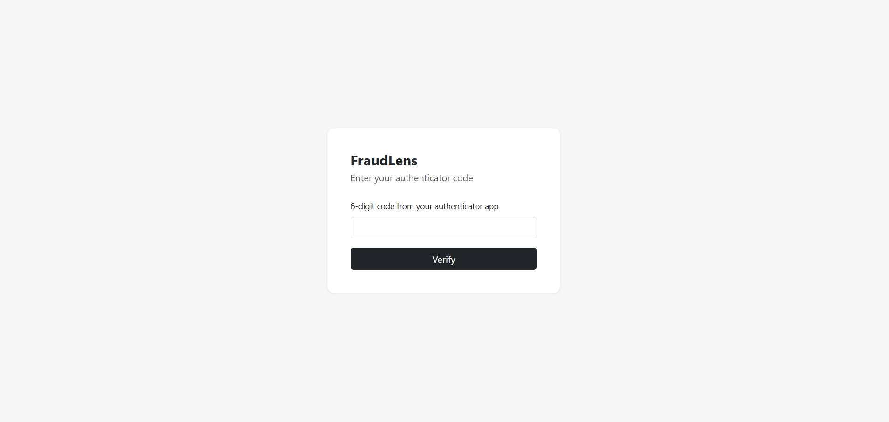
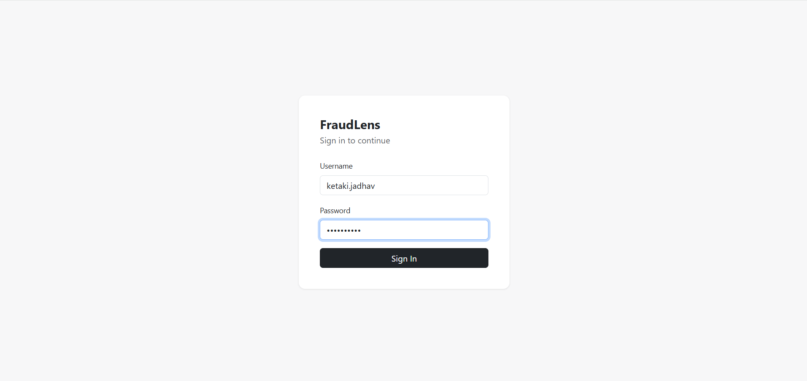
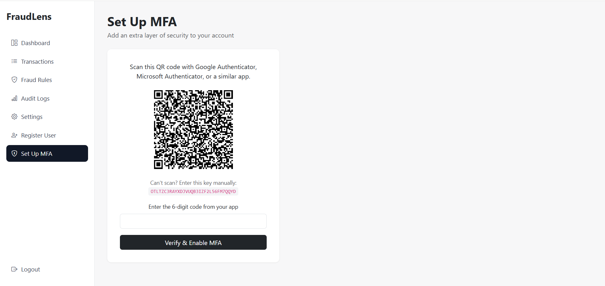
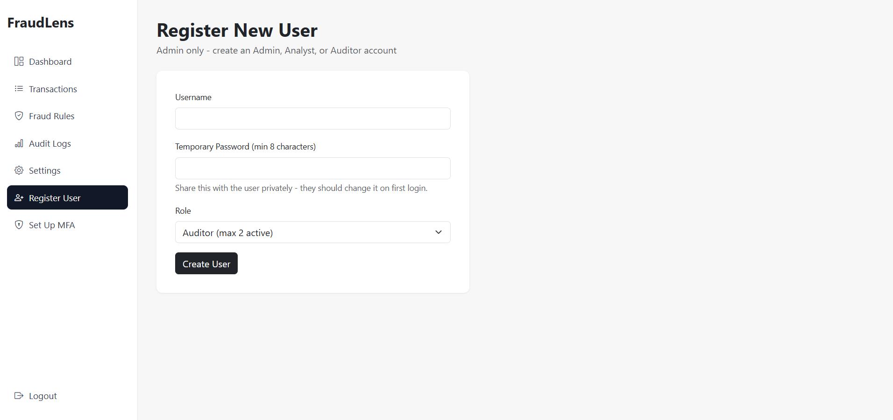
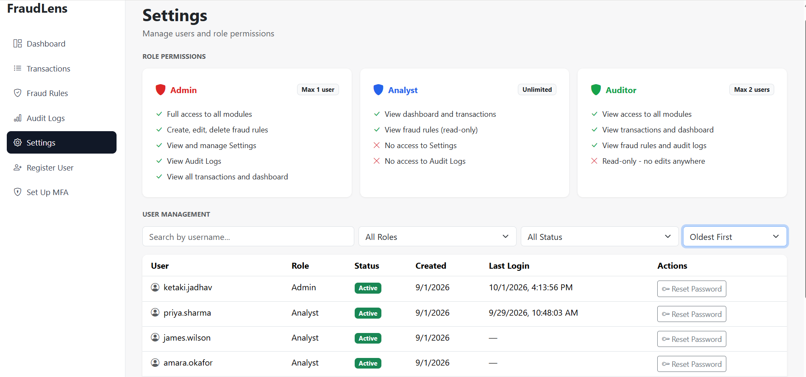

# FraudLens — PCI-DSS guidelines based Credit Card Fraud Detection & Transaction Monitoring System

FraudLens is a credit card transaction monitoring and fraud detection system that combines rule-based transaction monitoring with machine-learning-based anomaly detection. It has role based access control along with proper audit logging.

## Key Features

- Credit card transaction monitoring
- Rule-based fraud detection
- Machine-learning-based anomaly detection using Isolation Forest
- Risk-based transaction classification
- Role-based access control with Admin, Analyst, and Auditor roles
- Multi-factor authentication (MFA)
- Controlled access to sensitive information
- Audit logging
- Fraud rule configuration
- Transaction analytics dashboard

## Application Screenshots

### Analytics Dashboard

### Transaction Monitoring

### Fraud Rules

### Audit Logs

### Authentication

### Login

### Multi-Factor Authentication

### User Registration

### User Settings

